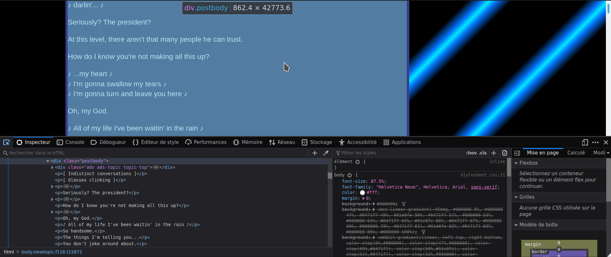

```{r include = FALSE}
knitr::opts_chunk$set(
  message = FALSE
)
```


[*The Americans*](https://en.wikipedia.org/wiki/The_Americans_(2013_TV_series)) is a TV show that tells the story of two KGB agents infiltrated in the USA in the 1980's. It shows us the life of these two people, who have to do espionage missions while taking care of their children and developing their own business as their cover.

Recently, I watched [the talk of Ryan Timpe](https://rstudio.com/resources/rstudioconf-2020/learning-r-with-humorous-side-projects/) at RStudio::conf 2020 about learning R with humorous side projects. It made me think about what projects I could develop to learn new things with R, and it pushed me to mix my interest both for *The Americans* and for R. I thought it would be interesting to analyze the dialogues of this TV show since it required learning two new skills: scraping web data to get the dialogues, and doing text analysis to explore these dialogues.


## Get the dialogues

### Find a source for the dialogues

Apparently, contrarily to [*Friends*](https://github.com/EmilHvitfeldt/friends), nobody developed a package containing the dialogues of *The Americans* yet. Therefore, I had to search online for these, and I found [this website](http://transcripts.foreverdreaming.org/viewforum.php?f=116) that contains all of the dialogues and other text information (lyrics, stage directions, etc.), with one page for one episode.

This website doesn't provide the dialogues for the end of season 6. However, this is not a big issue. Another drawback of this website is that it doesn't always provide information on who is talking, so it's not possible to analyze the words of a specific person. But it's good enough for me, I just want to train, the results don't matter here.

### Import the dialogues

Let's see how to import the dialogues with episode 1 of season 1. First of all, two packages will be needed:

```{r}
library(rvest)
library(tidyverse)
```

Now, we want to obtain the details of the page containing the dialogues for the first episode:

```{r}
page <- xml2::read_html("http://transcripts.foreverdreaming.org/viewtopic.php?f=116&t=15871")
```

This condenses all HTML information into two lists. But we only need the dialogues. Therefore, we have to find the HTML argument that contains them. To do so, we can use the Inspector in the webpage (Ctrl+Shift+C). When hovering elements on the webpage, we can see that there are several classes. Each line is embedded into `p`, but we notice that the whole text is in `div.postbody`.




Therefore, we can select only this class:

```{r}
page_text <- html_node(page, "div.postbody") %>%
  html_children() %>%
  xml2::xml_find_all("//div[contains(@class, 'postbody')]") %>%
  html_text(trim = TRUE)
```

Now, `page_text` is a very long vector that contains all text information. However, everything is not important here: we don't want to analyze the lyrics of the soundtrack, the stage directions, or the name of the person who is talking. The latter could be interesting if we had it for every sentence. However, we only have it occasionally, which makes it useless. To remove this irrelevant text, we will use `gsub()`, a base R function. 

```{r}
page_text_cleaned <- page_text %>%
  gsub("♪♪", "", .) %>% # double music symbol
  gsub("♪ [^♪]+♪", "", .) %>% # text between music symbol (= lyrics)
  gsub("\\n", " ", .) %>% # new line symbol
  gsub("\\t", " ", .) %>% # \t
  gsub("\\[[^\\]]*\\]", "", ., perl = TRUE) %>% # text between brackets
  gsub("\\([^\\)]*\\)", "", ., perl = TRUE) %>% # text between parenthesis
  gsub("\\\\", "", .) %>% # backslash
  gsub("\\(adsbygoogle = window.adsbygoogle \\|\\| \\).push\\(\\{\\}\\);", "", .) %>% # ads
  gsub("Philip:", "", .) %>% 
  gsub("Elizabeth:", "", .) %>%
  gsub("Paige:", "", .) %>%
  gsub("Henry:", "", .) %>%
  gsub("Stan:", "", .) 
```

The text is now cleaned: most of the useless text was removed, and 99% of what's left is the dialogues.


### Generalize this to all episodes

As I said before, there is a different page for each episode. How can we generalize the previous step to all these pages? 

Well, the code we used before will be the same once we have the HTML information of the episode page. The only problem here is that we must find a way to download this HTML information for all pages. We can notice that the URL addresses are almost identical for all episodes:

Episode 1, season 1: *http://transcripts.foreverdreaming.org/viewtopic.php?f=116&t=15871*

Episode 2, season 1: *http://transcripts.foreverdreaming.org/viewtopic.php?f=116&t=15872*

We see here that only the argument `t` differs between those addresses. If we could collect all the values of `t` for all the pages, we could then collect the HTML information very easily. There is now another problem: what are the values of `t`? We could suppose that we just need to add 1 to the previous number (15871, 15872, 15873...). However, for episode 12 in season 4 for example, the value of `t` is 27447. Therefore, we must find another way to collect these `t` values.

**Collect *t* values**

To do so, we use the Inspector once again, but this time on the home page, not on an episode page. Exploring the HTML tags, we notice that the `t` value is displayed in the class `a.topictitle`, among other information. 


Using the same code as before, we collect the text contained in this class, and extract the `t` value:

```{r}
# First we get the HTML information of the home page (menu 1)
menu_1 <- read_html("http://transcripts.foreverdreaming.org/viewforum.php?f=116")

# Then we obtain the text in this specific class and keep only the t value
episode_ids_1 <- html_node(menu_1, "body") %>%
  html_children() %>%
  xml2::xml_find_all("//a[contains(@class, 'topictitle')]") %>%
  sub('.*f=116&amp;t= *(.*?) *&amp;sid.*', "\\1", .) %>%
  as.numeric()
```

The last step for this first menu is to remove the two first `t` values (or ids), since they correspond to "Online Store" and "Board Updates" and not to episodes. 

```{r}
episode_ids_1 <- episode_ids_1[-c(1, 2)]
```

After repeating this operation for the other two menus, we finally obtain all the episode ids:

```{r}
### Second menu
menu_2 <- read_html("http://transcripts.foreverdreaming.org/viewforum.php?f=116&start=25")

episode_ids_2 <- html_node(menu_2, "body") %>%
  html_children() %>%
  xml2::xml_find_all("//a[contains(@class, 'topictitle')]") %>%
  sub('.*f=116&amp;t= *(.*?) *&amp;sid.*', "\\1", .) %>%
  as.numeric() 

episode_ids_2 <- episode_ids_2[-c(1, 2)]

### Third menu

menu_3 <- read_html("http://transcripts.foreverdreaming.org/viewforum.php?f=116&start=50")

episode_ids_3 <- html_node(menu_3, "body") %>%
  html_children() %>%
  xml2::xml_find_all("//a[contains(@class, 'topictitle')]") %>%
  sub('.*f=116&amp;t= *(.*?) *&amp;sid.*', "\\1", .) %>%
  as.numeric()

episode_ids_3 <- episode_ids_3[-c(1, 2)]


### All episodes ids
episode_ids_total <- c(episode_ids_1, episode_ids_2, episode_ids_3)
```

**Get the dialogues for all episodes**

The final step in this first part (obtaining the dialogues) is to get the dialogues for all pages. We already have the code for that, it is the first thing we made. Now, we only have to apply this code for each page, i.e for each episode id we got. To do so, we can use the `{purrr}` package (contained in the `{tidyverse}`):

```{r, cache = TRUE}
list_dialogues <- purrr::map(episode_ids_total, .f = function(x) {
  
  page <- read_html(paste0("http://transcripts.foreverdreaming.org/viewtopic.php?f=116&t=", x))
  
  page_text <- html_node(page, "div.postbody") %>%
    html_children() %>%
    xml2::xml_find_all("//div[contains(@class, 'postbody')]") %>%
    html_text(trim = TRUE)
 
  page_text_cleaned <- page_text %>%
    gsub("♪♪", "", .) %>%
    gsub("♪ [^♪]+♪", "", .) %>%
    gsub("\\n", " ", .) %>%
    gsub("\\t", " ", .) %>%
    gsub("\\[[^\\]]*\\]", "", ., perl = TRUE) %>%
    gsub("\\([^\\)]*\\)", "", ., perl = TRUE) %>%
    gsub("\\\\", "", .) %>%
    gsub("\\(adsbygoogle = window.adsbygoogle \\|\\| \\).push\\(\\{\\}\\);", "", .) %>%
    gsub("Philip:", "", .) %>%
    gsub("Elizabeth:", "", .) %>%
    gsub("Paige:", "", .) %>%
    gsub("Henry:", "", .) %>%
    gsub("Stan:", "", .) 
  
  return(page_text_cleaned)
  
})
```

We used the function `map()`, which takes two arguments: a list as input, and a function. The list we used is the list of all episode ids. The function is a custom function: it gathers the code we wrote previously and runs it for each episode id.

We now have `list_dialogues`, a list that contains 52 big character vectors (one per episode), corresponding to all the dialogues of the episodes.


## Analyze the dialogues

Now that we have all the dialogues for each episode, we can analyze them with the `{tidytext}` package. First, we must convert the big character vectors into tidy tibbles, i.e dataframes with one word per row. This can be done with `unnest_tokens()`, that we use in `map()` once again:

```{r}
library(tidytext)

list_dialogues_words <- map(list_dialogues, .f = function(x) {
  as_tibble(x) %>%
    unnest_tokens(word, value)
})  
```

### Number of words per episode per season

With this data, we can firstly see the number of words in each episode. To do so, we compute the number of rows (i.e words) per episode and then we plot them as lines to see the evolution throughout a season.

```{r}
map(list_dialogues_words, nrow) %>%
  unlist() %>%
  as_tibble() %>%
  tibble::rowid_to_column() %>%
  mutate(
    season = case_when(
      rowid %in% c(1:13) ~ 1,
      rowid %in% c(14:26) ~ 2,
      rowid %in% c(27:39) ~ 3,
      rowid %in% c(40:52) ~ 4,
      rowid %in% c(53:65) ~ 5,
      rowid %in% c(65:70) ~ 6
    )
  ) %>%
  mutate(rowid = c(rep(c(1:13), 5), 1:5)) %>%
  ungroup() %>%
  ggplot(aes(x = rowid, y = value, color = factor(season))) + 
  geom_line() +
  scale_x_discrete(name = "Episode number", limits = factor(c(1:13))) +
  scale_y_continuous(name = "Number of words") +
  ggtitle("Number of words per episode per season") +
  scale_color_discrete(name = "Season")
```

We can see that the first episode of the first season is by far the one with the most words. Maybe because the first one introduces us to the situation, the plot? It is also hard to verify that we didn't remove words by mistake in the dialogues of the other episodes.


### What words are the most said?

The `{tidytext}` package also allows us to identify the words that are the most used in the show. We will focus here on the first season but the code below can be easily adapted to analyze the other seasons.

An important item provided by `{tidytext}` is a dataset of stop words. Stop words are words that are very common in a language, and therefore that are irrelevant when doing text analysis. For example, "across", "after" or "actually" do not tell anything about a text because they are too common. Also, onomatopoeia (such as "yeah" or "ugh") do not carry much information.

To analyze the dialogues, we will remove those stop words and onomatopoeia using `anti_join()`. Then, we count the number of occurences and plot the results to see what words were the most used.

```{r}
onomatopoeia <- c("hey", "uh", "um", "yeah", "uhh", "hmm")

list_dialogues_words[[1]] %>%
  filter(!(word %in% onomatopoeia)) %>%
  anti_join(stop_words, by = c("word" = "word")) %>%
  count(word, sort = TRUE) %>% 
  filter(n > 5) %>%
  mutate(word = reorder(word, n)) %>%
  ggplot(aes(word, n)) +
  geom_col() +
  xlab(NULL) +
  coord_flip() +
  geom_text(aes(label = n), nudge_y = 1) +
  ggtitle("Most said words in episode 1 of season 1")
```

We could also do this for the whole first season:

```{r}
list_dialogues_words[1:13] %>%
  unlist() %>%
  as_tibble() %>%
  rename("word" = "value") %>%
  filter(!(word %in% onomatopoeia)) %>%
  anti_join(stop_words, by = c("word" = "word")) %>%
  count(word, sort = TRUE) %>%
  filter(n > 50) %>%
  mutate(word = reorder(word, n)) %>%
  ggplot(aes(word, n)) +
  geom_col() +
  xlab(NULL) +
  coord_flip() +
  geom_text(aes(label = n), nudge_y = 10) +
  ggtitle("Most said words in season 1")
```

As we could expect, KGB, FBI and agent are in the top 15. Philip is also much more present than Elizabeth.


### Sentiment analysis

Finally, we can wonder if those words carry more positive or negative messages. Indeed, `{tidytext}` also provides a dataset indicating if a word is positive or negative (or neutral). Therefore, we can count the number of positive and negative words in each episode.

```{r}
dialogues_sentiment <- map_dfr(list_dialogues_words, function(x) {
  x %>%
    inner_join(tidytext::sentiments) %>%
    count(sentiment)
}) %>%
  mutate(
    season = c(rep(c(1:5), each = 26), rep(6, 10)),
    episode = c(rep(rep(1:13, each = 2), times = 5), rep(1:5, each = 2))
  )
```

Then we can plot the evolution of this number during the four seasons:

```{r}
dialogues_sentiment %>%
  ggplot(aes(x = episode, y = n, color = factor(sentiment))) + 
  geom_line() +
  scale_x_discrete(name = "Episode number", limits = factor(c(1:13))) +
  scale_y_continuous(name = "Number of words") +
  ggtitle(paste0("Number of positive and negative words per episode and per season")) +
  facet_wrap(~ season) +
  scale_color_discrete("Sentiment")
```

And finally, we can determine the positive and negative words that are the most said in the first season:

```{r}
list_dialogues_words[1:13] %>%
  unlist() %>%
  as_tibble() %>%
  rename("word" = "value") %>%
  inner_join(tidytext::sentiments) %>%
  group_by(word) %>%
  mutate(n = n()) %>%
  ungroup() %>%
  distinct() %>%
  top_n(30) %>%
  mutate(word = reorder(word, n)) %>%
  ggplot(aes(word, n, fill = sentiment)) +
  geom_col() +
  xlab(NULL) +
  coord_flip() +
  facet_wrap(~ sentiment, scales = "free_y") +
  geom_text(aes(label = n), nudge_y = 10) + 
  ggtitle("Positive and negative words most used in season 1")
```


Overall I think the advice of Ryan Timpe is very good: side projects (humorous or not) are very useful to learn new skills in R. To write this blog post, I had to learn how to scrape the dialogues from a website with `{rvest}` and how to use the `{tidytext}` package. I hope this was useful to you too!

You can find all the code used in [this dedicated repo](https://github.com/etiennebacher/The-Americans).


<details>
<summary>
Session Info
</summary>
This is my session info, so that you can see the versions of packages used. This is useful if the results in my post are no longer reproducible because packages changed. The packages with a star (*) are those explicitely called in the script.

```{r, echo = FALSE}
sessioninfo::session_info()
```

</details>
