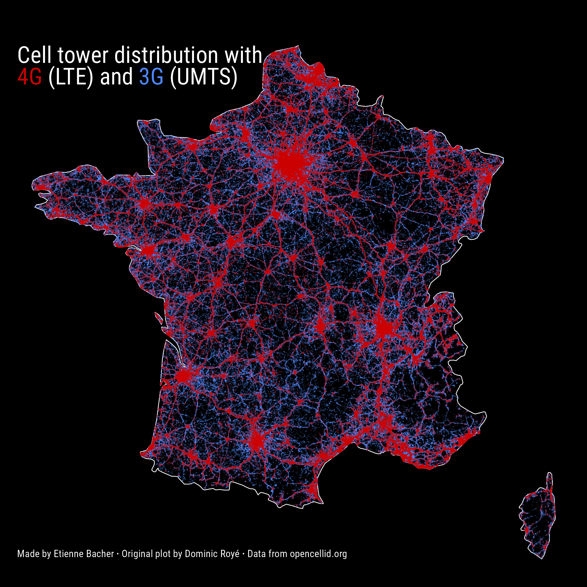
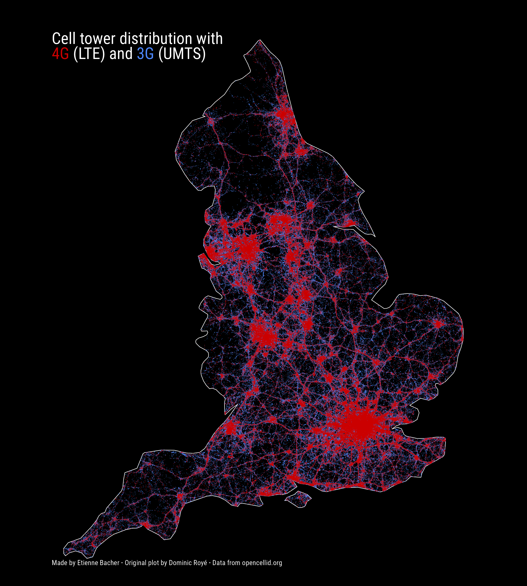

```{r setup, include=FALSE}
knitr::opts_chunk$set(echo = TRUE)
```

A few weeks ago, I found out about some maps made by [Dominic Royé](dominicroye.github.io/) (see [his gallery](https://dominicroye.github.io/en/graphs/) for more graphs). Among all those beautiful graphs, I decided to try reproducing those on 3G and 4G cell towers redistribution, like the one below for France.


Note that what I do here is just reproducing some maps to train with spatial data. All credits for the original maps go to Dominic Royé. 

Before we start, these are the packages we will need:

```{r}
library(dplyr)
library(readr)
library(ggplot2)
library(ggtext)
library(sf)
library(rnaturalearth)
```

Note that I will use native pipes `|>`, that are only available with R 4.1.0 and later versions. If your version is older, you can simply replace those by `%>%` from the package `magrittr`.

## Obtain and treat the data

### Obtain the data

As mentioned in the original plot, the data on cell towers location come from [OpenCellid](https://opencellid.org/), which is a community-created dataset containing the location of cell towers for several radio signals: LTE, UMTS and GSM.

This data is free to obtain, we only need to register with an email address and to precise the general purpose for which we want to obtain the data. We can then choose the country and download the data in a CSV file. Note that this dataset is updated daily, so the map could be a bit different if you do it much later.

### Treat the data

The data treatment is actually very simple because the data is already very tidy. The only thing to do here is to add geographical attributes to the dataframe with `st_as_sf()`:

```{r}
celltowers <- read_csv("208.csv") |> 
  st_as_sf(coords = c("lon", "lat"), crs = 4326)
```

While playing with the data, I noticed that the dates of creation of cell towers are expressed in seconds (more precisely in UNIX timestamp), so if we want to convert these as more natural dates, we can use `lubridate::as_datetime()`. I didn't use the dates to make the maps but it's still useful to know how to do that.

## Plot the data

We have three things to do:

* plot an empty map of France;
* add 3G cell towers location;
* add 4G cell towers location;

### Plot an empty map of France

To do that, we can use the package `rnaturalearth`:

```{r}
france <- ne_countries(scale = 'medium', type = 'map_units', returnclass = 'sf') |>
  filter(name == 'France') 
```

We can already plot that:

```{r}
ggplot() + 
  geom_sf(data = france)
```

### Add 3G and 4G cell towers location

While plotting those cell towers location, I noticed that, for some reason, some were located outside of France. Therefore, I chose keep only the locations that are inside the map of France we have. This can be done with `sf::st_intersection()`. Following Dominic Royé, I also separate 3G (UMTS) and 4G (LTE) cell towers (**this step is time consuming**):

```{r, cache = TRUE}
UMTS <- celltowers |> 
  filter(radio == "UMTS") |>
  st_intersection(france)

LTE <- celltowers |> 
  filter(radio == "LTE") |>
  st_intersection(france)
```

Now, we could plot all those points, but there are so many that it would completely hide the map so we need to use the smallest size possible for each point. Contrary to what one might expect, this is not done with the `size` argument but with the `shape` argument. Indeed, setting `shape = "."` means that each point will be the size of one pixel^[Thanks to [this StackOverflow answer](https://stackoverflow.com/a/51700192/11598948) for pointing that out.]. Still there are too many points compared to the original plot. The solution here is to decrease the opacity of each point:

```{r, cache = TRUE, fig.height=8}
ggplot() + 
  geom_sf(data = france, fill = "black", color = "white", size = 0.3) + 
  geom_sf(data = UMTS, shape = ".", color = "#4d88ff", alpha = 0.3) +
  geom_sf(data = LTE, shape = ".", color = "#cc0000", alpha = 0.5)
```

Now, we simply have to customize the plot a bit and to add labels, and we're done! Here is the final plot (**this is time consuming because of the large number of points**):

```{r}
x <- ggplot() + 
  geom_sf(data = france, fill = "black", color = "white", size = 0.3) + 
  geom_sf(data = UMTS, shape = ".", color = "#4d88ff", alpha = 0.3) +
  geom_sf(data = LTE, shape = ".", color = "#cc0000", alpha = 0.5) +
  theme_void() +
  labs(
    title = "<span style='color: white; text-align: center;'>Cell tower distribution with <br> <span style='color: #cc0000'>4G</span> (LTE) and <span style='color: #4d88ff'>3G</span> (UMTS)</span>",
    caption = "<span style='color: white;'> Made by Etienne Bacher <b>&middot;</b> Original plot by Dominic Royé <b>&middot;</b> Data from opencellid.org </span>"
  ) +
  theme(
    plot.background = element_rect(fill = "black"),
    panel.background = element_rect(fill = "black"),
    plot.title = element_markdown(margin = margin(t = 40, b = -60, l = 10), size = 20),
    plot.caption = element_markdown(hjust = 0, margin = margin(l = 10, b = 20, t = -30)),
    text = element_text(family = "Roboto Condensed")
  )

ggsave("my_plot_fr.png", plot = x, height = 7, width = 7)
```




If you want to do it for another country than France, such as England, you can simply download the data for England on opencellid.org, use the map of England from `rnaturalearth`, apply the same code as above, and voilà!

```{r, code_folding=TRUE}
celltowers_eng <- read_csv("234.csv") |> 
  st_as_sf(coords = c("lon", "lat"), crs = 4326)

eng <- ne_countries(scale = 'medium', type = 'map_units', returnclass = 'sf') |>
  filter(name == 'England') 

UMTS <- celltowers_eng |> 
  filter(radio == "UMTS") |>
  st_intersection(eng)

LTE <- celltowers_eng |> 
  filter(radio == "LTE") |>
  st_intersection(eng)

x <- ggplot() + 
  geom_sf(data = eng, fill = "black", color = "white", size = 0.3) + 
  geom_sf(data = UMTS, shape = ".", color = "#4d88ff", alpha = 0.3) +
  geom_sf(data = LTE, shape = ".", color = "#cc0000", alpha = 0.5) +
  theme_void() +
  labs(
    title = "<span style='color: white; text-align: center;'>Cell tower distribution with <br> <span style='color: #cc0000'>4G</span> (LTE) and <span style='color: #4d88ff'>3G</span> (UMTS)</span>",
    caption = "<span style='color: white;'> Made by Etienne Bacher <b>&middot;</b> Original plot by Dominic Royé <b>&middot;</b> Data from opencellid.org </span>"
  ) +
  theme(
    plot.background = element_rect(fill = "black"),
    panel.background = element_rect(fill = "black"),
    plot.title = element_markdown(margin = margin(t = 40, b = -60, l = 10), size = 20),
    plot.caption = element_markdown(hjust = 0, margin = margin(l = 10, b = 20, t = -30)),
    text = element_text(family = "Roboto Condensed")
  )

ggsave("my_plot_eng.png", plot = x, height = 10, width = 9)
```

