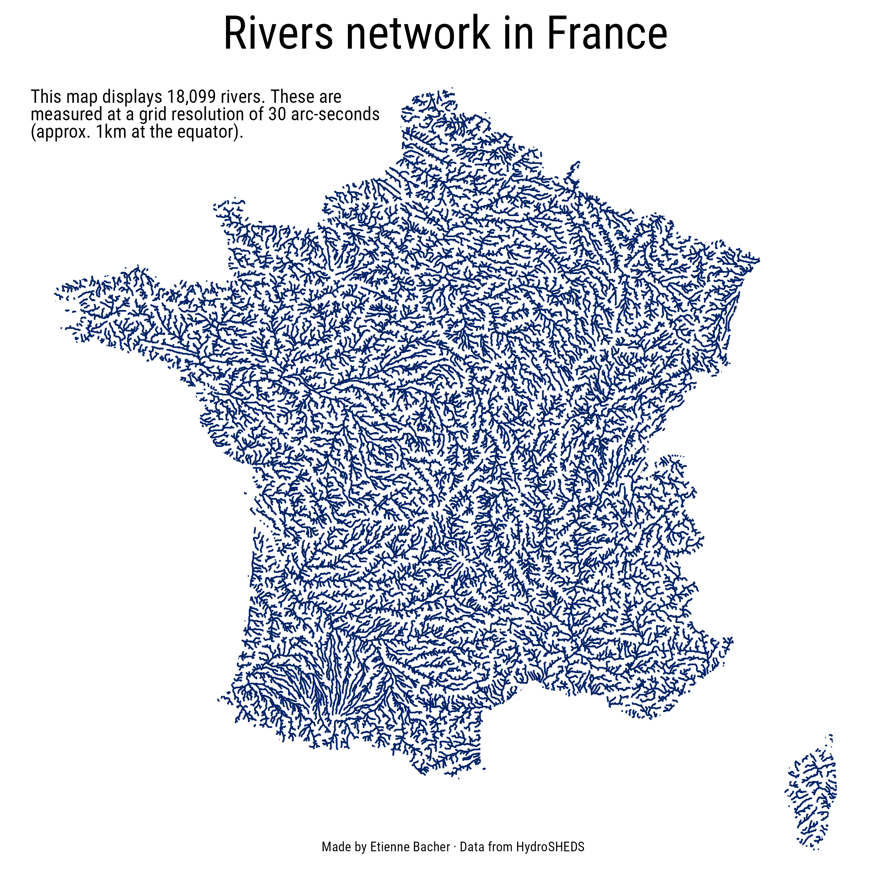
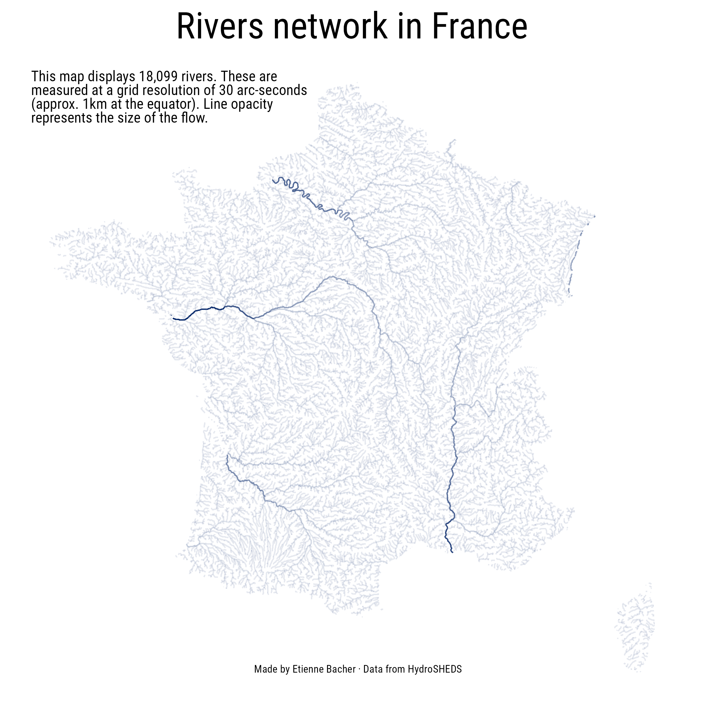

```{r setup, include=FALSE}
knitr::opts_chunk$set(echo = TRUE)
```


Once again inspired by [Dominic Royé](https://dominicroye.github.io/en/graphs/geography/)'s maps, I decided to map rivers in France. The dataset I use comes from [HydroSHEDS](https://hydrosheds.org/). The code below is quite similar to the code in my [previous post](https://www.etiennebacher.com/posts/2021-12-23-reproduce-some-maps-about-3g-and-4g-access/) so I don't spend a lot of time on it.

```{r}
library(ggplot2)
library(ggtext)
library(sf)
library(rnaturalearth)
```

```{r, cache = TRUE}
france <- ne_countries(country = "France", scale = 'medium',
                       type = 'map_units', returnclass = 'sf')  

rivers_30sec <- read_sf("eu_riv_30s/eu_riv_30s.shp") |>
  st_intersection(france)
```

```{r}
x <- ggplot() +
  geom_sf(
    data = rivers_30sec, 
    color = "#002266"
  ) +
  labs(
    title = "Rivers network in France",
    subtitle = "This map displays 18,099 rivers. These are<br> measured at a grid resolution of 30 arc-seconds<br> (approx. 1km at the equator).",
    caption = "Made by Etienne Bacher &middot; Data from HydroSHEDS"
  ) +
  theme_void() +
  theme(
    plot.background = element_rect(fill = "white", color = "white"),
    panel.background = element_rect(fill = "white", color = "white"),
    plot.title = element_markdown(hjust = 0.5, size = 30, margin = margin(t = 10, b = -20)),
    plot.subtitle = element_markdown(margin = margin(t = 40, b = -60, l = 10), size = 12),
    plot.caption = element_markdown(hjust = 0.5, margin = margin(l = 10, b = 20, t = -30)),
    text = element_text(family = "Roboto Condensed")
  )

ggsave("france_30sec.png", plot = x, width = 8, height = 8)
```



This plot shows the density of rivers in France. Now, if we want to show which rivers are the most important, we can modify the opacity of the lines depending on their flow:

```{r}
x <- ggplot() +
  geom_sf(
    data = rivers_30sec, 
    mapping = aes(alpha = UP_CELLS),
    color = "#002266"
  ) +
  labs(
    title = "Rivers network in France",
    subtitle = "This map displays 18,099 rivers. These are<br> measured at a grid resolution of 30 arc-seconds<br> (approx. 1km at the equator). Line opacity<br> represents the size of the flow.",
    caption = "Made by Etienne Bacher &middot; Data from HydroSHEDS"
  ) +
  theme_void() +
  theme(
    plot.background = element_rect(fill = "white", color = "white"),
    panel.background = element_rect(fill = "white", color = "white"),
    plot.title = element_markdown(hjust = 0.5, size = 30, margin = margin(t = 10, b = -20)),
    plot.subtitle = element_markdown(margin = margin(t = 40, b = -60, l = 10), size = 12),
    legend.position = "none",
    plot.caption = element_markdown(hjust = 0.5, margin = margin(l = 10, b = 20, t = -30)),
    text = element_text(family = "Roboto Condensed")
  )

ggsave("france_30sec_opac.png", plot = x, height = 8, width = 8)
```

