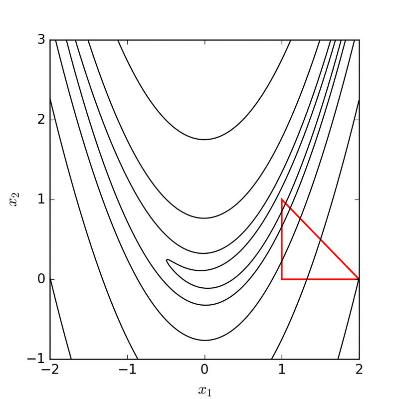

```{r setup, include=FALSE}
knitr::opts_chunk$set(echo = TRUE)
options(scipen = 999)
```

Like many others, my family is quite split geographically: some are in Europe but
in different countries, and some are in other continents. Given this distance 
between us, we don't gather in a single place that often.

This got me thinking: in which place should we meet if we wanted to minimize the
total distance, i.e the sum of the distances made by each one? I'm just thinking 
in terms of distance as the crow flies, because of course the distance also depends
on where we must go to take the plane, on the potential flight connections we have
to make, etc.

This question is frequent in a lot of optimal location problems. For example, 
where should a factory be built so that it minimizes the sum of distances to a 
list of warehouses? However, I didn't know about it before thinking about my
original question, and it's not as simple as it looked like to me. I thought a
bit more about that, searched online, asked to other members of my family more
comfortable with maths, and this blog post summarizes what I learnt from that. 

As every other post on this blog, it will include some R code, but that will 
come later.

# The problem on a 2D plan

The question I want to answer is: where should my family meet in order to minimize
the total distance? Something that is not clearly mentioned here is that I want 
to minimize the total distance **on a sphere** (because, surprise, the Earth is
close to a sphere). This adds a layer of complexity, so let's start with a 2D
analysis.

Suppose I have 5 points placed on a grid like below:

<center>
```{tikz, echo=FALSE, fig.ext = 'png'}
\usetikzlibrary{decorations.pathreplacing,angles,quotes}
\colorlet{DarkGreen}{green!40!black!60}
\colorlet{LightBlue}{blue!60!white!40}
\colorlet{LightRed}{red!40!white!60}
\colorlet{DarkRed}{red!40!black!60}
\begin{tikzpicture}[scale=1.3]
  \draw[step=1cm,lightgray,very thin] (-3,-2) grid (5,5);
  \draw [<-] (0,5) -- (0,-2);
  \draw [->] (-3,0) -- (5,0);
  \draw[fill] (1,0) circle [radius=0.05];
  \node [red, below] at (1,0) {$(1,0)$};
  \draw[fill] (2,1) circle [radius=0.05];
  \node [red, below] at (2,1) {$(2,1)$};
  \draw[fill] (-3,0) circle [radius=0.05];
  \node [red, left] at (-3,0) {$(-3,0)$};
  \draw[fill] (-2,2) circle [radius=0.05];
  \node [red, above] at (-2,2) {$(-2,2)$};
  \draw[fill] (0,3) circle [radius=0.05];
  \node [red, left] at (0,3) {$(0,3)$};
\end{tikzpicture}
```
</center>

I want to find the point $(X,Y)$ that minimizes the sum of distances from each
point to $(X,Y)$. Here, I use the [Euclidean distance](https://en.wikipedia.org/wiki/Euclidean_distance), but other measures 
are possible (such as the [Manhattan distance](https://en.wikipedia.org/wiki/Taxicab_geometry)). The formula for the Euclidean distance between two points $(x_1, y_1)$ and $(x_2, y_2)$ is:

$$dist = \sqrt{(x_1-x_2)^2 + (y_1-y_2)^2}$$

For example, the distance between the points $(1,0)$ and $(2,1)$ is^[To be sure, 
we know that the distance between those two points is the diagonal of a square
with sides of length 1, and that the length of the diagonal of a square with
sides of length $a$ is $a\sqrt{2}$.]:

\begin{align}
dist = & \sqrt{(1-2)^2 + (0-1)^2}\\
= & \sqrt{1+1} \\
= & \sqrt{2}
\end{align}


Here, I want to find the point $(X,Y)$ that minimizes:

$$Total \ distance = D = \sum_{i=1}^5\sqrt{(x_i-X)^2 + (y_i-Y)^2}$$

The point $(X,Y)$ that solves this is called the [geometric median](https://en.wikipedia.org/wiki/Geometric_median), or $L_1$-median. If we
only had two points, then any point on the segment between those two points would
be a solution^[For example, if the two points are separated by 1000 km, then
putting the meeting point at 200 km from one and 800 km from the other would give
the same total distance as putting the meeting point at 500 km far from each
point.], but here, we have five points.

However, according to Wikipedia,

> Despite the geometric median's being an easy-to-understand concept, computing it
poses a challenge. [...] Therefore, only numerical or symbolic approximations to
the solution of this problem are possible under this model of computation.

In other words, while it is theoretically possible to compute the exact solution
to this problem, it is impossible to do so in reasonable time in practice when 
the number of points is very large (note that there are some special cases, such
as $n=3$ or $n=4$). This is why we need to use an approximation algorithm. 

We can use the Nelder-Mead method, which is a common method for function
minimization. We first take a starting point, say $(0, 0)$. Two other points 
will be taken randomly. Then, the algorithm computes the function we want to
minimize (here, the total distance) for each of the three random points. The two
lowest points are kept, and the algorithm replaces the third one by its symmetric
point relative to the line between the two lowest points. But an animation is
worth a thousand words:

{width=75%}

<sup> Animation by Nicoguaro - Own work, CC BY 4.0, https://commons.wikimedia.org/w/index.php?curid=51597575 </sup>

In the animation above, the triangle moves and shrinks until it reaches the
minimum. There are more available options than just reflecting the highest point.
I found these two blog posts very helpful to understand how the Nelder-Mead 
method works:

* by [Mathias Brandewinder](https://brandewinder.com/2022/03/31/breaking-down-Nelder-Mead/)
* by [Alex Dowad](https://alexdowad.github.io/visualizing-nelder-mead/)


Another algorithm that is commonly used for that is the Weiszfeld algorithm. The
idea is to start from a point $(X_0, Y_0)$, update it using its derivatives to
get $(X_1, Y_1)$, and continue this process until the distance between two updates
is under a certain threshold. I won't use this method here, so click on the arrow 
below if you want more details.

<details> 

<summary>Click here to have more details about Weiszfeld algorithm and its R implementation.</summary>

<br>

List of steps in Weiszfeld algorithm: 

* pick a random point $P_0 = (X_0, Y_0)$
* compute $X_1 = \frac{\sum_{i=1}^5 \frac{x_i}{\sqrt{(x_i-X_0)^2 + (y_i-Y_0)^2}}}{\sum_{i=1}^5 \frac{1}{\sqrt{(x_i-X_0)^2 + (y_i-Y_0)^2}}}$ and $Y_1 = \frac{\sum_{i=1}^5 \frac{x_i}{\sqrt{(x_i-X_0)^2 + (y_i-Y_0)^2}}}{\sum_{i=1}^5 \frac{1}{\sqrt{(x_i-X_0)^2 + (y_i-Y_0)^2}}}$
* compute the distance $\varepsilon$ between $(X_0, Y_0)$ and $(X_1, Y_1)$
* repeat steps 2 and 3 until $\varepsilon$ is lower than an arbitrary threshold. This will give an approximate solution $(X, Y)$.

To get the expressions above, we differentiate with respect to $X$:


\begin{equation}
\frac{\partial D}{\partial X} = 0 \\
\sum_{i=1}^5\frac{\partial \sqrt{(x_i-X)^2 + (y_i-Y)^2}}{\partial X} = 0 \\
\sum_{i=1}^5 -\frac{- 2x_i + 2X}{2\sqrt{(x_i-X)^2 + (y_i-Y)^2}} = 0 \\
\sum_{i=1}^5 \frac{x_i - X}{\sqrt{(x_i-X)^2 + (y_i-Y)^2}} = 0 \\
\sum_{i=1}^5 \frac{x_i}{\sqrt{(x_i-X)^2 + (y_i-Y)^2}} - \sum_{i=1}^5 \frac{X}{\sqrt{(x_i-X)^2 + (y_i-Y)^2}} = 0 \\
\sum_{i=1}^5 \frac{x_i}{\sqrt{(x_i-X)^2 + (y_i-Y)^2}} - X \sum_{i=1}^5 \frac{1}{\sqrt{(x_i-X)^2 + (y_i-Y)^2}} = 0 \\
X = \ \frac{\sum_{i=1}^5 \frac{x_i}{\sqrt{(x_i-X)^2 + (y_i-Y)^2}}}{\sum_{i=1}^5 \frac{1}{\sqrt{(x_i-X)^2 + (y_i-Y)^2}}} \\
X^* = \ T(X^*) 
\end{equation}


Similarly,

\begin{align}
Y^* = & \ \frac{\sum_{i=1}^5 \frac{x_i}{\sqrt{(x_i-X)^2 + (y_i-Y^*)^2}}}{\sum_{i=1}^5 \frac{1}{\sqrt{(x_i-X)^2 + (y_i-Y^*)^2}}} \\
Y^* = & \ T(Y^*) 
\end{align}

Now, we can make a loop like the following:

* start with $X = X_0$ and $Y = Y_0$, and compute $X_1 = T(X_0)$ and $Y_1 = T(Y_0)$
* compute $X_2 = T(X_1)$ and $Y_2 = T(Y_1)$
* continue until the distance between $(X_n, X_{n+1})$ and $(Y_n, Y_{n+1})$ is smaller than an arbitrary $\varepsilon$. 

Once again, I'm not mathematician, so this may seem not rigorous at all for someone with more experience. If you're interested in a rigorous explanation of Weiszfeld's algorithm, check out [this paper](https://ssabach.net.technion.ac.il/files/2015/12/BS2015.pdf) (but there are many others online).

<br>

As usual with R, when you think of a widely used algorithm or feature, there's necessarily an R package for that. Here, I will use the package `Gmedian` and the function `Weiszfeld()`:

```{r}
library(Gmedian)
```

This function has 4 arguments:

* `X` is a matrix of points, where each row is an observation;
* `weights` is useful if we want to give more importance to some points. Here, we assume that all 4 points are equally important, so we set it to `NULL` (the default);
* `epsilon` is the threshold below which the algorithm will stop;
* `nitermax` is the maximum number of iterations that will be run. This is complementary to `epsilon`: the algorithm stops as soon as the difference between two $(X, Y)$ is lower than `epsilon` or as the algorithm hits the maximum number of iterations.

We can keep the defaults for `epsilon` and `nitermax`, so we just need to create a matrix containing our four points, and run this in `Weiszfeld()`:

```{r}
# Create matrix
my_points <- rbind(c(1, 0), c(2, 1), c(-3, 0), c(0, 3), c(-2,2))
my_points

median_point <- Weiszfeld(my_points)
median_point
```

We can now compute the sum of distances between each original point and the geometric median:

```{r}
list_dist <- c()
for (i in 1:nrow(my_points)) {
  foo <- my_points[i, ]
  list_dist[i] <- dist(rbind(foo, median_point$median))
}
sum(list_dist)
```

</details>


We can use the Nelder-Mead algorithm in R with the function `optim()` in the
`stats` package (included in base R). First, we write the objective function and
feed `optim()` with it, along with the parameters (our list of points and a point
from which to start).

```{r}
# Inputs:
# - starting_p: a vector (x, y) indicating from which point to start
# - my_p: a matrix where each row is a point in our list
criterion_2D <- function(starting_p, my_p) {
  # Formula for the sum of Euclidean distances
  f <- sum(sqrt((starting_p[1] - my_p[, 1])^2 + (starting_p[2] - my_p[, 2])^2))
}

output <- optim(par = c(0, 0), criterion_2D, my_p = my_points)

# Location of the optimal point
output$par

# Total distance
output$value
```

As we can see, this solution automatically gives us the optimal location and the
total distance. It also doesn't require an external package, which is interesting
if you want to reduce the dependencies you use. In the example above, the optimal point is therefore at (`r round(output$par[1], 2)`, `r round(output$par[2], 2)`), 
and the total distance is `r round(output$value, 2)`:

```{tikz, echo=FALSE, fig.ext = 'png'}
\usetikzlibrary{decorations.pathreplacing,angles,quotes}
\colorlet{DarkGreen}{green!40!black!60}
\colorlet{LightBlue}{blue!60!white!40}
\colorlet{LightRed}{red!40!white!60}
\colorlet{DarkRed}{red!40!black!60}
\begin{tikzpicture}[scale=1.3]
  \draw[step=1cm,gray,very thin] (-3,-2) grid (5,5);
  \draw [<-] (0,5) -- (0,-2);
  \draw [->] (-3,0) -- (5,0);
  \draw[fill] (1,0) circle [radius=0.05];
  \node [red, below] at (1,0) {$(1,0)$};
  \draw[fill] (2,1) circle [radius=0.05];
  \node [red, below] at (2,1) {$(2,1)$};
  \draw[fill] (-3,0) circle [radius=0.05];
  \node [red, left] at (-3,0) {$(-3,0)$};
  \draw[fill] (-2,2) circle [radius=0.05];
  \node [red, above] at (-2,2) {$(-2,2)$};
  \draw[fill] (0,3) circle [radius=0.05];
  \node [red, left] at (0,3) {$(0,3)$};
  \draw[fill] (-0.27,1.36) circle [radius=0.05];
  \node [blue, left] at (-0.27,1.36) {$(-0.27,1.36)$};
\end{tikzpicture}
```


Now that we know how to solve the problem in 2D, let's move to 3D with a sphere, 
where it is slightly more complicated.


# The problem with a sphere

## Finding points on a sphere

Points on a sphere are often referred to by their latitude and longitude. However,
if we want to compute the distance between points on a sphere, we need to get
3 coordinates $(x,y,z)$. How do we do that?

First, we have to change the unit of the points to use radians instead of degrees.
This is done by multiplying the values in degrees by pi and dividing them by 180.

Then, we need to compute the 3 coordinates $x$, $y$, and $z$ as follows:

$x = cos(latitude) \times cos(longitude) \times R$

$y = cos(latitude) \times sin(longitude) \times R$

$z = sin(latitude) \times R$

where $R$ is the radius of the sphere.

Let's make an example. We define some random points on a sphere with their 
latitude and longitude in degrees:

```{r}
# R = earth radius (km) 
R <- 6200

# Latitude, longitude for a few locations in degrees
latitude <- c(45, -40, 30, -30)
longitude <- c(-10, 10, 50, 50)

# Convert to radians
latitude_r <- latitude * pi / 180
longitude_r <- longitude * pi / 180

# x,y,z coordinates for the locations
x <- cos(latitude_r) * cos(longitude_r) * R
y <- cos(latitude_r) * sin(longitude_r) * R
z <- sin(latitude_r) * R

my_points <- cbind(x,y,z)
my_points
```

## Computing the distance

We know how to express the location of points using three coordinates. We can now
think about how we will measure the distance between these points. 

Suppose we have two points, $P_1$ and $P_2$, and we want to measure the distance
$l$. If we were in an Euclidean space, we would compute the distance $d$ between
the two points, which is equal to $\sqrt{(x_1-x_2)^2 + (y_1-y_2)^2 + (z_1-z_2)^2}$,
but that's not what we're looking for because it doesn't take into account the 
curvature of the sphere.

```{tikz, echo=FALSE, fig.ext = 'png', fig.width=3, fig.align="center"}
\usetikzlibrary{shapes, angles, quotes}
\begin{tikzpicture}[scale = 1]
\draw[step=1cm,white,very thin] (-2,-2) grid (2,2);
\draw (0,0) circle (2cm);

\draw[fill] (0,0) circle [radius=0.05];
\draw[fill] (0,2) circle [radius=0.05];
\draw[fill] (1.5,1.32) circle [radius=0.05];

\draw (0,0) -- (0,2);
\draw (0,0) -- (1.5,1.32);
\node [left] at (0, 1.3) {$R$};
\draw [red] (0,2) -- (1.5,1.32);
\node [red, above] at (1,1.1) {$d$};

\coordinate (a) at (0,0);
\coordinate (b) at (0,2);
\coordinate (c) at (1.5,1.32);

\draw pic[draw,angle radius=1cm,"$\theta$" shift={(4mm,5mm)}] {angle=c--a--b};
\draw pic[draw, blue,angle radius=2cm,"$l$" shift={(5mm,9mm)}] {angle=c--a--b};
\node [above] at (0,2) {$P_1$};
\node [right] at (1.5,1.32) {$P_2$};
\end{tikzpicture}
```

By definition, $l = R \times \theta$. We know the radius, so we need to compute
$\theta$. The triangle is isosceles, so dividing the angle in two equal parts 
will give us two rectangle triangles where we can compute $\frac{\theta}{2}$.
Indeed, 
$$sin(\frac{\theta}{2}) = \frac{d/2}{R} $$
$$\frac{\theta}{2} = arcsin(\frac{d/2}{R})$$
$$\theta = 2 \times arcsin(\frac{d/2}{R})$$

```{tikz, echo=FALSE, fig.ext = 'png', fig.width=3, fig.align="center"}
\usetikzlibrary{shapes, angles, quotes}
\begin{tikzpicture}[scale = 1]
\draw[step=1cm,white,very thin] (-2,-2) grid (2,2);
\draw (0,0) circle (2cm);

\draw (0,0) -- (0,2);
\draw (0,0) -- (1.5,1.32);
\draw [red] (0,2) -- (1.5,1.32);
\draw [red, thick] (0.75,1.68) -- (1.5,1.32);
\node [red, above] at (0.95,0.9) {$\mathbf{d/2}$};

\draw[fill] (0,0) circle [radius=0.05];
\draw[fill] (0,2) circle [radius=0.05];
\draw[fill] (1.5,1.32) circle [radius=0.05];

\coordinate (a) at (0,0);
\coordinate (b) at (0,2);
\coordinate (c) at (1.5,1.32);

\draw pic[draw,angle radius=1cm, shift={(4mm,5mm)}] {angle=c--a--b};
\draw pic[draw, blue,angle radius=2cm,"$l$" shift={(5mm,9mm)}] {angle=c--a--b};
\node [above] at (0,2) {$P_1$};
\node [right] at (1.5,1.32) {$P_2$};

\draw [red] (0,0) -- (0.75,1.68);

\end{tikzpicture}
```

Therefore, we have:
$$l = 2R \times arcsin(\frac{d/2}{R})$$

Now that we have a way to measure the distance between two points based on their
3 coordinates, we can follow the same procedure as in the 2D case: make a 
function and give it to `optim()`. However, the objective function to minimize
is different because we now use the formula above for the distance.

```{r}
# Inputs:
# - starting_p: a vector (lat, long, both in degrees) indicating from which point to start
# - my_p: a matrix where each row is a point in our list, and 3 columns (one for
#   each dimension)
criterion_3D <- function(starting_p, my_p) {
  # Convert degrees in radians
  plat <- starting_p[1] * pi / 180
  plon <- starting_p[2] * pi / 180
  # Compute the x, y, z coordinates
  x <- cos(plat) * cos(plon) * R
  y <- cos(plat) * sin(plon) * R
  z <- sin(plat) * R

  # Return the total distance
  sum(
    2*R*asin(
      sqrt(
        (x - my_points[, 1])^2 + (y - my_points[, 2])^2 + (z - my_points[, 3])^2
      )
    / 2 /R)
  )
}
```

We can now apply once again the `optim()` function:

```{r}
# Initial point (latitude, longitude, in degrees)
y <- optim(c(0,0), criterion_3D, my_p = my_points) 
y$par
y$value
```

So in this dummy example, the optimal location is in `r round(y$par[1], 2)`°
lat., `r round(y$par[2], 2)`° long., and the total distance 
`r round(y$value, 2)` km.

## Making an interactive globe

Now the most important part: show the solution on a globe! There are several ways
to do this. One of them is to use `echarts4r`:

```{r echo = !knitr::is_latex_output(), eval=!knitr::is_latex_output()}
library(echarts4r)
library(echarts4r.assets)
coords <- data.frame(
  lat = latitude,
  long = longitude,
  lat_sol = y$par[1],
  long_sol = y$par[2]
)

coords |> 
  e_charts() |> 
  
  # create the globe
  e_globe(
    base_texture = ea_asset("world"), 
    displacementScale = 0.05,
    shading = "color",
    viewControl = list(autoRotate = FALSE, targetCoord = c(10, 0))
  ) |> 
  
  # add the starting points
  e_scatter_3d(
    long, lat,
    coord_system = "globe",
    symbolSize = 15,
    itemStyle = list(color = "red"),
    emphasis = list(label = list(show = FALSE))
  ) |> 
  
  # add the solution
  e_scatter_3d(
    long_sol, lat_sol,
    coord_system = "globe",
    symbolSize = 15,
    itemStyle = list(color = "yellow")
  ) |> 
  
  # add tooltip with latitude and longitude (only works for
  # starting points)
  e_tooltip(
    trigger = "item",
    formatter = htmlwidgets::JS("
      function(params){
        return('Longitude: ' + params.value[0] + '<br />Latitude: ' + params.value[1])
      }
    ")
  ) |> 
  e_legend(FALSE)
```

We now have a solution, but the question is: what if the optimal meeting point is
located in the middle of the Pacific Ocean? That wouldn't be the most convenient
point for a family meeting (unless you have a yacht).

So far, we didn't care about this. We did some unconstrained optimization. The 
next step is to add the constraint that the meeting cannot happen at a place covered by oceans. I will try to explore that in a future post, but so far I 
didn't find many resources on this. If you have some ideas on how to do this or
where to start from, feel free to let a comment.

Thanks for having read so far!