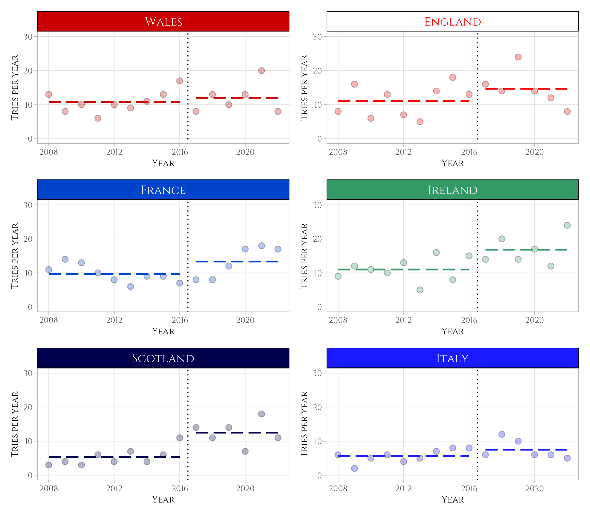

The 6 Nations is a rugby tournament that takes place every year in February-March
between the six strongest national teams in Europe: England, France, Ireland,
Italy, Scotland, and Wales. Each team plays against the other five. A victory gives 4 points, a draw gives 2 points, and a loss gives 0 point. 

In 2017, bonus points were introduced: 

* a try bonus point: you get one extra point if you score 4 tries or more during 
the match, whatever the final result;
* a losing bonus point: you get one extra point if you lose the match by 7
points or less.

Therefore, a victory can now give you 5 points maximum and a loss can give you 
1 point. Additionally, a team that makes the Grand Slam (wins all 5 matches) 
gets a bonus of 3 points^[This is to ensure that a team that makes the Grand
Slam also wins the tournament.].

The idea behind these new rules were to improve the drama by pushing teams to 
score more tries. In this post, I'd like to check if we saw an increase in the
number of tries since 2017. 

I'm not going to make a deep exploration or to find whether or not there is a 
true causal effect between this new rule and the number of tries. It's just a
good pretext to do some scraping and some graphs.


# Getting the data

```{r setup, include=FALSE}
knitr::opts_chunk$set(echo = TRUE)
options(scipen = 999)
```

```{r}
library(rvest)
library(tidyverse)
library(patchwork)
```

I didn't find a clean dataset with the results for the latest editions, so we
can scrape the [ESPN website](https://www.espn.co.uk/rugby/table/_/league/180659/season/2022) instead. It only goes back to 2008 but it will do the
job.

The URLs are identical except for the tournament year. Once we get the HTML for
one year, we can extract the table with its CSS classes, and then format it 
nicely with `html_table()`.

```{r cache = TRUE}
results <- list()
for (i in 2008:2022) {
  print(paste0("Scraping year ", i))
  results[[i]] <- read_html(
    paste0("https://www.espn.co.uk/rugby/table/_/league/180659/season/", i)
  ) |> 
    html_element(css = ".standings .has-team-logos") |> 
    html_table() |> 
    mutate(year = i)
}
```

We can then aggregate this list into a single dataframe.

```{r}
all_results <- data.table::rbindlist(results) |>
  rename(country = "Six Nations") |> 
  mutate(
    country = case_when(
      grepl("Wales", country) ~ "Wales",
      grepl("England", country) ~ "England",
      grepl("Italy", country) ~ "Italy",
      grepl("France", country) ~ "France",
      grepl("Scotland", country) ~ "Scotland",
      grepl("Ireland", country) ~ "Ireland"
    )
  )
```


# Plotting the data

First, let's see the total number of tries for each year.

```{r}
FONT <- "Cinzel"

showtext::showtext_auto()
sysfonts::font_add_google(FONT)

theme_custom <- function(...) {
  theme_light() +
  theme(
    panel.grid.minor = element_blank(),
    text = element_text(family = FONT)
  )
}

labs <- list(
  x = "Year",
  y = "Tries per year"
)

all_results |> 
  summarise(tries_per_year = sum(TF), .by = year) |> 
  ggplot(aes(year, tries_per_year)) +
  geom_point(color = "black", fill = "#99b3e6", shape = 21, size = 2.5) +
  geom_vline(xintercept = 2016.5, linetype = "dashed") +
  ylim(c(0, 100)) +
  labs(
    title = "Number of tries per tournament",
    x = labs$x,
    y = labs$y
  ) +
  theme_custom() +
  theme(
    axis.title = element_text(size = 28),
    axis.text = element_text(size = 25),
    plot.title = element_text(size = 35)
  )
```


We see an increase in the number of tries, but this upward trend started before
2017, putting into question the real causal effect of this new rule. Was this
increase similar for all countries?

```{r, eval=FALSE}
plots <- list()
for (i in unique(all_results$country)) {
  
  main_color <- switch(i,
    "Ireland" = "#339966",
    "France" = "#0044cc",
    "England" = "white",
    "Wales" = "#cc0000",
    "Scotland" = "#00004d",
    "Italy" = "#1a1aff"
  )
  
  text_color <- switch(i,
    "Ireland" = "white",
    "France" = "white",
    "England" = "red",
    "Wales" = "white",
    "Scotland" = "white",
    "Italy" = "white"
  )
  
  plots[[i]] <-
    all_results |>
    filter(country == i) |>
    mutate(after = as.numeric(year >= 2017)) |>
    rename(tries_per_year = TF) |>
    mutate(
      mean = mean(tries_per_year), .by = after
    ) |>
    mutate(
      mean_before = ifelse(after == 0, mean, NA),
      mean_after = ifelse(after == 1, mean, NA)
    ) |>
    ggplot(aes(year, tries_per_year)) +
    geom_point(
      color = "black", 
      fill = ifelse(main_color == "white", text_color, main_color), 
      alpha = 0.3, 
      shape = 21, 
      size = 2.5
    ) +
    geom_line(
      aes(y = mean_before), 
      linetype = "longdash", 
      color = ifelse(main_color == "white", text_color, main_color), 
      linewidth = 0.8
    ) +
    geom_line(
      aes(y = mean_after), 
      linetype = "longdash", 
      color = ifelse(main_color == "white", text_color, main_color), 
      linewidth = 0.8
    ) +
    geom_vline(xintercept = 2016.5, linetype = "dotted") +
    ylim(c(0, 30)) +
    labs(
      x = labs$x,
      y = labs$y
    ) +
    facet_grid(. ~ country) +
    theme_custom() +
    theme(
      strip.background = element_rect(fill = main_color, color = "black"),
      strip.text = element_text(size = 36, colour = text_color),
      axis.title = element_text(size = 28),
      axis.text = element_text(size = 25)
    )
}

wrap_plots(plots, ncol = 2)
```

```{r, layout="l-body-outset", echo = FALSE}
# ggsave("patchwork.png", height = 7, width = 8)

```

The dashed lines before and after 2017 show the average number of tries per 
country and per tournament. We can see that, on average, all teams scored more
tries after 2017 than before 2017. 

However, this change is very heterogenous: some countries had a large increase
(Ireland, Scotland), some had a moderate change (France, England), and other 
didn't seem to be affected a lot (Wales, Italy). 
