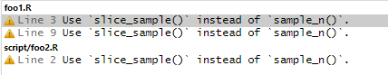

```{r setup, include=FALSE}
knitr::opts_chunk$set(echo = TRUE, eval = FALSE)
```


Slightly less than a year ago, I created [`flir`](https://flir.etiennebacher.com/) (named `flint` at the time).
The objective was to have a tool to detect and automatically correct a set of "bad practices" in R code.
Those "bad practices" do not necessarily mean the code is wrong, simply that it is possible to improve its readability, robustness, and performance. 
If you are already familiar with [`lintr`](), you could think of `flir` as an extension that is faster and applies automatic fixes (at the expense of not covering the entire set of `lintr`'s rules).

## Detecting and fixing bad practices

`flir` provides 3 types of functions: linter functions, fixer functions, and helper functions:

* linter functions give the same capability as `lintr`: they detect bad practices in the code and report them with messages indicating what's wrong.
* fixer functions go one step further and automatically fix those bad practices in code. Note that not all rules can be automatically fixed.
* helper functions make it easier to use `flir` on a regular basis. They can create a dedicated folder where you can specify which rules you want to use and define your own, and they can create a Github Actions workflow to check the existence of bad practices on each commit.

You might be worried about this "automatic fixing" feature. After all, what if the fix is wrong? 
What if I want to go back to the previous situation? 
In this case, you should read this [vignette on the website](https://flir.etiennebacher.com/articles/automatic_fixes) that details a couple of actions you can take to be more confident about this.

I won't repeat the package documentation and examples here.
Rather, I'd like to explain how `flir` allows one to go further fixing "bad practices" and can be helpful when refactoring projects.

## `flir` can rewrite (almost) anything

Originally, `flir` was created to be an extension of `lintr`, but it can do more than that.
`flir` works by detecting specific code patterns and rewriting them using the Rust crate [`ast-grep`](https://ast-grep.github.io/). 
This isn't limited to linter rules, it can be applied to any R code.

Let's take an example.

### Rewriting superseded functions

[`dplyr`](https://dplyr.tidyverse.org/index.html) contains several functions marked as "deprecated" or "superseded". 
Deprecated means that those functions will be removed in a later version of the package because they have some weaknesses that cannot be easily fixed or because there are alternative functions that are always better to use.
Those functions are not supported anymore, meaning that bugs won't be fixed, so you should update your code if you use them.
Superseded means that the function still works and is still supported in terms of fixing bugs, but there are better alternatives that are more efficient or readable for instance.

Let's say we have several occurrences of [`dplyr::sample_n()`](https://dplyr.tidyverse.org/reference/sample_n.html) in our project. This function is superseded and we should use `slice_sample()` instead. First, after installing `flir`, we can create a `flir` folder with `flir::setup_flir()`. Then we add a new rule with `flir::add_new_rule("superseded-sample-n")`.

This creates the file below (`flir/rules/custom/superseded-sample-n.yml`):

```yaml
id: superseded-sample-n
language: r
severity: warning
rule:
  pattern: ...
fix: ...
message: ...
```

### Creating the rule

Now we must define the patterns we want to detect in the code.
For now, let's say we want to catch usages of `sample_n(my_data, 10)` and `sample_n(my_data, size = 10)` and replace them with `slice_sample(my_data, n = 10)`^[`my_data` and `10` are just placeholders here, they could be anything.]. 
We want to detect two patterns and replace them with the same code, so we can use `any` in this situation:

```yaml
id: superseded-sample-n
language: r
severity: warning
rule:
  any:
    - pattern: sample_n($DATA, size = $N)
    - pattern: sample_n($DATA, $N)
fix: ...
message: ...
```

Note that we have used *metavariables* here: `$DATA` and `$N`. 
Those will capture any code that fits in the `pattern`. 
We can then reuse those metavariables when we define the `fix` and `message`, but we'll need to use a double tilde instead of `$` to use them:

```yaml
id: superseded-sample-n
language: r
severity: warning
rule:
  any:
    - pattern: sample_n($DATA, size = $N)
    - pattern: sample_n($DATA, $N)
fix: slice_sample(~~DATA~~, n = ~~N~~)
message: Use `slice_sample()` instead of `sample_n()`.
```

We now have our rule. 
The only thing left to do is to list in the `flir/config.yml` file so that it is taken into account by `flir::lint_*()` and `flir::fix_*()` functions:

```yaml
keep:
  - any_duplicated
  [...]
  - which_grepl
  - superseded-sample-n
```

Alternatively, we can leave it out of the config file and specify it by hand, such as `flir::lint("my_file.R", linters = "superseded-sample-n")`.

### Applying the rule

Now the only thing left to do is to run `flir` on the files we want. 

For this example, I have created two files in a project: 

* `foo1.R`:

```{r}
df <- tibble(x = 1:5, w = c(0.1, 0.1, 0.1, 2, 2))

sample_n(df, 3)
sample_n(df, 10, replace = TRUE)
sample_n(df, 3, weight = w)

n_rows <- 3

foo(sample_n(df, n_rows))
```

* `script/foo2.R`:

```{r}
if (nrow(sample_n(df, size = 3)) > 0) {
  print("hi")
}
```

First, let's see how many times we find those patterns in our code. 
We can run `flir::lint()` and it will open a "Markers" window in RStudio (if you don't use RStudio, it will print the messages in the R console):

{width="75%"}

We have three occurrences that can be fixed. 
I can now run `flir::fix()` (note that I don't use Git for this demo project, so I will have to manually confirm I want to run this).

`foo1.R` now looks like this (I manually added the comments):

```{r}
df <- tibble(x = 1:5, w = c(0.1, 0.1, 0.1, 2, 2))

slice_sample(df, n = 3)          # fixed
sample_n(df, 10, replace = TRUE) # not fixed
sample_n(df, 3, weight = w)      # not fixed

n_rows <- 3

foo(slice_sample(df, n = n_rows)) # fixed
```

Several occurrences of `sample_n()` weren't modified.
This is because they don't match any of the `pattern`s we defined in the rule: they include additional arguments such as `weight` and `replace`. 
We would need to include those additional patterns in the rule to fix them.
Since they would need different replacements to account for the additional arguments, we can create an extra rule in the same file using `---` to separate them (and don't forget to change the `id`!):

```yaml
id: superseded-sample-n
language: r
severity: warning
rule:
  any:
    - pattern: sample_n($DATA, size = $N)
    - pattern: sample_n($DATA, $N)
fix: slice_sample(~~DATA~~, n = ~~N~~)
message: Use `slice_sample()` instead of `sample_n()`.

---

id: superseded-sample-n-2
language: r
severity: warning
rule: ...
fix: ...
message: ...
```

Similarly, `script/foo2.R` is now:

```r
if (nrow(slice_sample(df, n = 3)) > 0) { # fixed
  print("hi")
}
```

### Going further

In this example, I have shown very simple patterns to detect, but it is possible to use much more advanced rules, using nested patterns and regular expressions for instance. 

Take a look at those rules in `flir` to see what it can do: [`redundant_ifelse`](https://github.com/etiennebacher/flir/blob/main/inst/rules/builtin/redundant_ifelse.yml), [`stopifnot_all`](https://github.com/etiennebacher/flir/blob/main/inst/rules/builtin/stopifnot_all.yml), [`literal_coercion`](https://github.com/etiennebacher/flir/blob/main/inst/rules/builtin/literal_coercion.yml).

## Conclusion

`flir` is useful to detect bad practices in R code, but its usage doesn't stop here.
It can be used to rewrite any R code you want using flexible patterns, which can be very valuable in projects involving many R files.

In the future, I would like to add a feature enabling package developers to provide a set of rules, for instance to replace deprecated and superseded functions in their package, that users would be able to use directly.

If you find bugs, would like more features, or simply have further questions, head to the [Issues page](https://github.com/etiennebacher/flir/issues?q=sort%3Aupdated-desc+is%3Aissue+is%3Aopen)!